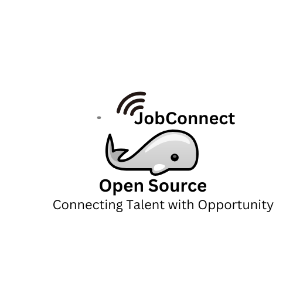

# JobConnect - Open Source Job Board Platform

<p align="center">
  
</p>

<p align="center">
  <a href="https://github.com/BotCoder254/JobConnect/blob/main/LICENSE">
    
  </a>
  <a href="https://github.com/BotCoder254/JobConnect/releases">
    
  </a>
  <a href="https://python.org">
    
  </a>
  <a href="https://github.com/BotCoder254/JobConnect/stargazers">
    
  </a>
</p>

<p align="center">
  <b>Connecting Talent with Opportunity - Open Source and Free for All</b>
</p>

---

## 📋 Table of Contents

- [Overview](#-overview)
- [Key Features](#-key-features)
- [Technology Stack](#-technology-stack)
- [Getting Started](#-getting-started)
- [Documentation](#-documentation)
- [Contributing](#-contributing)
- [Contributors](#-contributors)
- [License](#-license)
- [Acknowledgements](#-acknowledgements)

## 🚀 Overview

JobConnect is an open-source, state-of-the-art job board platform designed to bridge the gap between talented professionals and top-tier companies worldwide. Our platform offers a seamless, intuitive experience for job seekers, employers, and administrators alike.

## 🌟 Key Features

### For Job Seekers
- 📝 Create and manage comprehensive user profiles
- 📄 Upload and organize resumes with ease
- 🔍 Advanced job search with smart filtering
- 📨 Apply to jobs using custom application forms
- 📊 Track application status in real-time
- 🎯 Receive personalized job recommendations

### For Employers
- 🏢 Build and maintain detailed company profiles
- 📢 Post and manage job listings effortlessly
- 👥 Review and process job applications efficiently
- 🖼️ Upload company logos and job-related media

### For Administrators
- 👨‍💼 Comprehensive user and company management
- 📈 Access to detailed platform analytics
- 🛡️ Content moderation tools

## 💻 Technology Stack

<p align="center">
  
  
  
  
  
  
  
  
</p>

## 🚀 Getting Started

1. Clone the repository   ```
   git clone https://github.com/BotCoder254/JobConnect.git
   cd JobConnect   ```
2. Set up a virtual environment
3. Install dependencies
4. create an uploads folder in the static folder 
5. Configure environment variables
6. Initialize the database
7. Run the development server

For detailed instructions, see the [Installation](DOCUMENTATION.md#installation) section in our documentation.

## 📚 Documentation

For comprehensive information about installation, configuration, and usage, please refer to our [Documentation](DOCUMENTATION.md).

## 🤝 Contributing

We welcome contributions to JobConnect! As an open-source project, we believe in the power of community collaboration. Please see our [Contributing Guidelines](CONTRIBUTING.md) for more details on how to get started.

## 👥 Contributors

We'd like to express our heartfelt gratitude to all the contributors who have helped make JobConnect better:

<table>
  <tr>
    <td align="center">
      <a href="https://github.com/BotCoder254">
        
        <br />
        <sub><b>Telvin Teum</b></sub>
      </a>
      <br />
      <a href="#code-BotCoder254" title="Code">💻</a>
      <a href="#design-BotCoder254" title="Design">🎨</a>
      <a href="#doc-BotCoder254" title="Documentation">📖</a>
    </td>
    <td align="center">
      <a href="https://github.com/Hyake">
        
        <br />
        <sub><b>Hyake</b></sub>
      </a>
      <br />
      <a href="#code-contributor2" title="Code">💻</a>
    </td>
    <!-- Add more contributors as needed -->
     <a https://github.com/SamuelDevp">
        
        <br />
        <sub><b>Samuel Devp</b></sub>
      </a>
      <br />
      <a href="#code-BotCoder254" title="Code">💻</a>
      <a href="#design-BotCoder254" title="Design">🎨</a>
      <a href="#doc-BotCoder254" title="Documentation">📖</a>
  </tr>
</table>

## 📄 License

This project is licensed under the MIT License. See the [LICENSE](LICENSE) file for details.

## 🙏 Acknowledgements

- [Flask](https://flask.palletsprojects.com/) - The web framework used
- [MongoDB](https://www.mongodb.com/) - Database
- [Tailwind CSS](https://tailwindcss.com/) - CSS framework
- [Docker](https://www.docker.com/) - Containerization
- [Heroku](https://www.heroku.com/) - Cloud platform

## 📞 Contact

For any questions or concerns, please [open an issue](https://github.com/BotCoder254/JobConnect/issues) on GitHub or contact the maintainers directly.

---

<p align="center">
  <i>Coded with ❤️ by <a href="https://github.com/BotCoder254">Telvin Teum</a> and the open-source community</i>
</p>

<p align="center">
  <a href="https://github.com/BotCoder254">
    
  </a>
  <a href="https://twitter.com/teumtelvin">
    
  </a>
</p>
